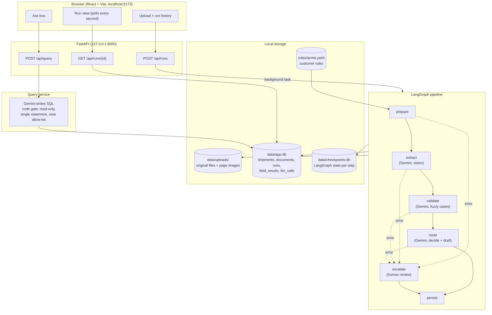

# Trade Document Pipeline

A small multi-agent system that reads a trade document (a commercial invoice, for now),
checks it against one customer's rules, and decides what happens next: approve it
automatically, send it to a person, or draft an amendment request to the supplier. It runs on
a laptop, uses Google's Gemini model through a free API key, and stores everything in a
single local SQLite file.

Built for GoComet's Full-Stack AI Engineer "Day At Work" assignment, Part 1.

Three agents:
- **Extractor** — reads the document with a vision-capable Gemini call and pulls 8 required
  fields, each grounded against the page's own text and given a confidence score.
- **Validator** — checks each field against a customer's YAML rule set: match, mismatch, or
  uncertain, with what was found vs what was expected.
- **Router** — decides auto-approve, human review, or an amendment request, and explains why.
  Code enforces which outcomes are even allowed before the model picks one, so a wrong
  document can never be silently approved.

On top of the pipeline: a plain-English "ask a question" endpoint over the stored results, a
FastAPI backend, and a React operator screen.

The full design is in [`docs/design-architecture.md`](docs/design-architecture.md); a
plain-language walkthrough of every piece, written to be learned from, is in
[`Ansh/`](../Ansh/).

## Architecture



Where state lives: during a run, in the LangGraph state, checkpointed after every node; after
a run, the final result in `app.db`, which is all the UI and the query layer ever read from.
Everything under `data/` is git-ignored and can be deleted to reset.

## Requirements

- **Python 3.14** (verified on 3.14.2, Windows 11)
- **Node.js** (any version `npm create vite` supports; exact versions are pinned in
  `frontend/package.json`)
- **A Google AI Studio API key** (free tier): https://aistudio.google.com/apikey

Commands below are PowerShell, since that's what this project was built and tested on. On
macOS/Linux, swap `python3` for `py` and `source .venv/bin/activate` for the
`.venv\Scripts\...` paths.

## Setup

### 1. Backend

```powershell
cd backend
py -3.14 -m venv .venv
.venv\Scripts\python -m pip install -r requirements-dev.txt
```

Copy `backend/.env.example` to `backend/.env` and fill in your Gemini API key:

```powershell
Copy-Item .env.example .env
notepad .env   # set GEMINI_API_KEY=your-key-here
```

`backend/.env` is git-ignored — it never gets committed.

### 2. Generate the sample documents

The test invoices (with known correct answers) are generated by a script, and the generated
files are already committed so you don't have to. To regenerate them yourself (byte-identical
output, on the same OS):

```powershell
# From the repo root
backend\.venv\Scripts\python -m samples.generate
```

This writes 28 grid documents (`samples/grid/`), 3 submission samples
(`samples/submission/`), and 1 JPG (`samples/jpg/`), each with a `.answer.json` file beside it
holding the correct values.

### 3. Frontend

```powershell
cd frontend
npm install
```

(If PowerShell blocks `npm.ps1` with an execution-policy error, use `npm.cmd install`
instead.)

## Running it

### The full app: API + UI

```powershell
# Terminal 1: the backend API (binds to 127.0.0.1:8000 only — no login, so it must not be
# reachable from other machines)
cd backend
.venv\Scripts\python -m app.main

# Terminal 2: the frontend dev server (proxies /api to the backend, no CORS setup needed)
cd frontend
npm run dev
```

Then open http://localhost:5173. Pick "ACME Electronics Pte. Ltd.", upload one of the three
files in `samples/submission/`, and watch the run:

1. Progress steps (prepare → extract → validate → route) update as the run advances, polled
   once a second.
2. The decision card shows the outcome, a one-line reason, the decision source
   (`llm` / `code_override` / `fallback`), and match/mismatch/uncertain counts, plus an LLM
   usage strip (call count, tokens, latency, whether the fallback model kicked in).
3. The full reasoning is shown, and — for a document with a discrepancy — the amendment
   draft, with a copy button.
4. The field table lists every field's value, both confidences, its verdict (shown with an
   icon as well as text, not colour alone), found vs expected, and the rule ID. A collapsed
   "LLM call log" section below it lists every individual call attempt.
5. The Ask box at the bottom answers plain-English questions about everything stored so far
   (see below).

The API's own interactive docs are at http://127.0.0.1:8000/docs.

Once `frontend/dist` exists (`npm run build`), the backend serves the built frontend itself,
so the whole app then runs from a single command (`python -m app.main`) with no separate dev
server needed.

Not built: an evidence viewer that highlights the matched text on the page image itself
(field values are shown as text, not overlaid on the document).

### The Ask box (plain-English questions)

Type a question like "How many documents were flagged for review this week?" and it's turned
into a read-only SQL query by Gemini, run through a safety gate (single statement only, a
read-only connection, an allow-list of exactly two summary views, never the raw tables, a
query timeout, and a row limit), and answered with the SQL shown alongside so it's never a
black box. Each real question spends one Gemini call.

### Just the pipeline: the command line

The CLI works independently of the API, and is what the eval script uses:

```powershell
cd backend
.venv\Scripts\python -m app.cli run ..\samples\submission\01-clean-correct.pdf --customer acme
```

This prints the run ID and the final outcome. Behind the scenes it:

1. Checks the upload (file type, size, page count).
2. Renders every page and reads its text (the PDF's own text layer, or OCR for a scan).
3. Calls Gemini to extract the 8 required fields, with grounding and confidence checks.
4. Validates each field against `backend/rules/acme.yaml`.
5. Routes to a final decision (auto-approve, human review, or an amendment draft).
6. Saves everything to `data/app.db`, and the run's checkpoint to `data/checkpoints.db`.

If the process is interrupted partway through, resume every unfinished run with:

```powershell
.venv\Scripts\python -m app.cli resume
```

The API does the same resume automatically on start-up, so a crash mid-run doesn't leave it
stuck in `processing` forever after a restart either.

To read back every run's LLM call log as a Markdown file, without a browser or a SQL client:

```powershell
.venv\Scripts\python -m app.cli dump-llm-calls
```

Writes to `data/llm-calls-report.md`. `eval/reports/llm-calls-sample.md` is a checked-in
example of this output.

Uploaded files, rendered page images and both database files live under `data/`, which is
git-ignored — delete the whole folder any time to reset to a clean state.

### Offline eval

```powershell
# From the repo root. Real Gemini calls (~10-12 total) against the free tier.
backend\.venv\Scripts\python -m eval.run_eval
```

Runs the 3 submission samples through the real pipeline, scores each field's verdict and the
final outcome against its `.answer.json`, and writes `eval/reports/submission-smoke-run.md`
and `.json`. This is never run automatically and does spend real Gemini quota.

Real result from the last run (checked in at `eval/reports/submission-smoke-run.md`): 24/24
field verdicts correct across all three samples, both error documents correctly routed to
amendment/review, zero wrong auto-approvals.

### Sample queries

```powershell
# From the repo root, after at least one document has gone through the pipeline. 6 real
# Gemini calls (one per question) against the free tier.
backend\.venv\Scripts\python -m eval.run_sample_queries
```

Runs the query layer's six worked-example questions against the real, populated `data/app.db`
and writes each question, the SQL Gemini wrote for it, and the result to
`docs/sample-queries.md`.

## Tests

```powershell
cd backend

# Everything except tests that call the real Gemini API (the default)
.venv\Scripts\python -m pytest

# Only the tests that call Gemini (spends free-tier quota; run sparingly)
.venv\Scripts\python -m pytest -m live

# Lint and format check
.venv\Scripts\ruff check . ..\samples --config pyproject.toml
.venv\Scripts\ruff format --check . ..\samples --config pyproject.toml
```

The non-live suite has over 13,000 tests (dominated by one deliberately exhaustive test:
every combination of match/mismatch/uncertain across the 8 fields, checking that the Router
never auto-approves unless every field genuinely matched), plus API tests that exercise a
full upload-to-completion run through FastAPI's test client. All of it runs against a
scripted fake LLM transport — no test in the default run ever makes a real network call or
spends Gemini quota.

Frontend:

```powershell
cd frontend
npm run build
npm run lint
```

## Repo layout

```
GoCometrepo/
  README.md                 this file
  backend/
    app/
      main.py                FastAPI app, resumes incomplete runs on start-up
      config.py               settings, from environment variables
      api/                     HTTP routes and response schemas
      graph/                   LangGraph state, nodes, the pipeline graph, the CLI's engine
      agents/                  Extractor, Validator, Router
      ingest/                  file checks, PDF/image rendering, OCR
      trust/                   grounding, normalisers, formats, confidence, guardrails
      rules/                   YAML loader and rule-type checkers
      llm/                     the Gemini client wrapper: retries, fallback, budget, prompts/
      store/                   SQLite schema, query views, the repository
      query/                   plain-English question -> SQL, with the safety gate
      cli.py                   python -m app.cli run|resume|resume-one|dump-llm-calls
    rules/acme.yaml            ACME's rules (one YAML file per customer)
    tests/
  frontend/                    Vite + React (plain JavaScript)
    src/
      api/                     api.js (one function per endpoint)
      components/               upload panel, run list, progress steps, decision card,
                                reasoning/draft, field table, ask panel, call log
  samples/                     python -m samples.generate (run from the repo root)
    grid/                      28 eval documents + answer files
    submission/                3 submission samples + answer files
    jpg/                       one image-upload test case
  eval/                        eval runner (run_eval.py) and its reports/
  docs/                        design doc, implementation plan, progress log, failure log
  data/                        git-ignored: app.db, checkpoints.db, uploads/
```

## Notes for the grader

- **No login, local only.** The API binds to `127.0.0.1` only. It's not meant to be exposed
  to a network.
- **The Gemini key is never committed.** `backend/.env` is git-ignored.
- **Free-tier quota is limited.** The default Gemini model gets roughly 20 requests/day free;
  its fallback gets roughly 500/day. Tests never spend quota (they run against a scripted
  fake transport); only `pytest -m live`, `eval.run_eval`, and actually running the pipeline
  or the Ask box do.
- **Known limitations:** the offline eval runs against the 3 submission samples instead of a
  full multi-document grid, so the confidence threshold stays at its untuned default of 0.85;
  the UI has no page-image evidence overlay; the query layer's own security test suite covers
  the core protections (read-only connection, single-statement check, authorizer, timeout,
  row limit) but not every edge case a production hardening pass would add. None of these
  touch the required safety behaviours (grounding, guardrails against a silent wrong
  approval, or the query gate's core protections).
